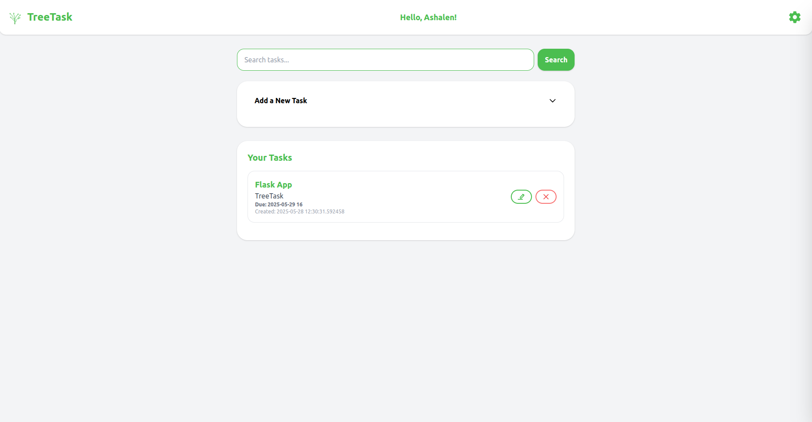
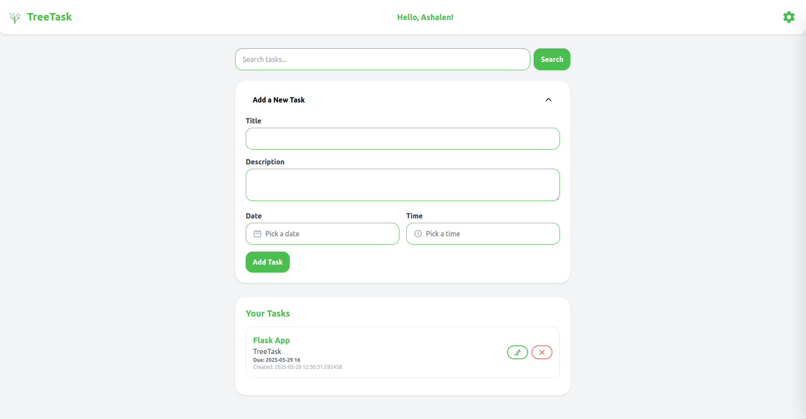
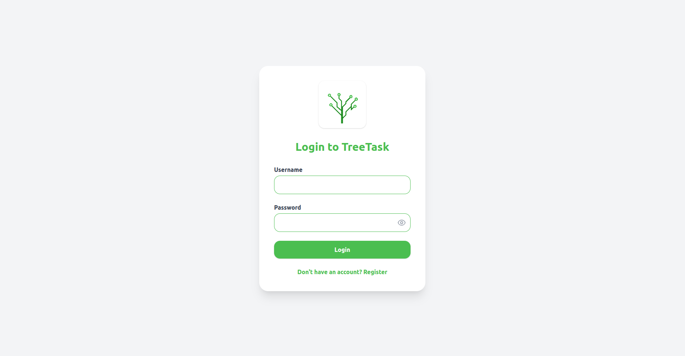
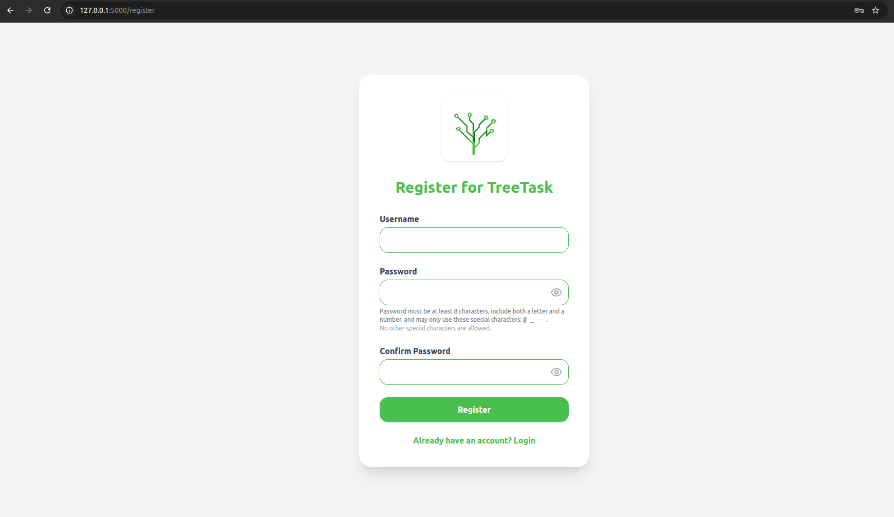
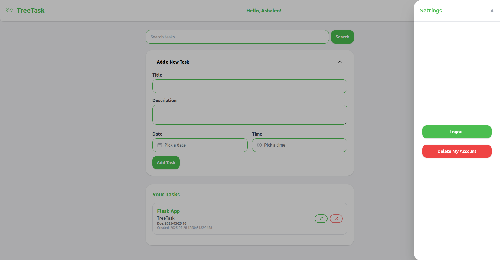

<<<<<<< HEAD
# TreeTask
=======
# TreeTask

TreeTask is a Flask-based personal task management system that allows users to securely manage their tasks. The application follows the MVC (Model-View-Controller) architecture and uses SQLite for data storage.

## Features
- User authentication (login, logout, registration)
- Secure password hashing (Werkzeug)
- Session-based login (Flask-Login)
- CRUD operations for tasks (Create, Read, Update, Delete)
- REST API endpoint for tasks
- CSRF protection for all forms
- Tailwind CSS for modern UI styling
- Due date and time support for tasks
- Task sorting by due date and creation date

## Project Structure
```
/TreeTask
├── /templates         # HTML templates (Jinja2)
├── /static
│   └── /css           # Tailwind CSS output (or CDN used in templates)
├── /controllers       # Flask routes and business logic
├── /models            # Database interactions (using sqlite3)
├── config.py          # Application configuration
├── app.py             # Main Flask application entry point
├── requirements.txt   # Python dependencies
└── README.md          # Project documentation
```

## Setup Instructions
1. **Clone the repository**
2. **Install dependencies:**
   ```bash
   pip install -r requirements.txt
   ```
3. **Run the application:**
   ```bash
   python3 app.py
   ```
4. **Access the app:**
   Open your browser and go to `http://127.0.0.1:5000`

## Database File
- The `treetask.db` file is a binary SQLite database. It is not human-readable in a text editor. This is normal and secure.
- Passwords are stored as secure hashes, not in plain text.
- To inspect or manage your data, use the `sqlite3` command-line tool or a GUI SQLite browser.

## Key Libraries Used
- Flask
- Flask-Login
- Werkzeug
- Flask-WTF
- SQLite (via Python's built-in `sqlite3`)
- Tailwind CSS (via CDN)

## Security Features
- All user input (login, registration, tasks) is sanitized via Jinja2 escaping and Flask's escape function to prevent XSS.
- CSRF protection is enabled for all forms using Flask-WTF.
- Passwords are securely hashed using Werkzeug before storage.
- Session-based authentication is managed with Flask-Login, with all sensitive routes protected by `@login_required`.
- Password policy: Minimum 8 characters, must include both a letter and a number, and may only use these special characters: `@ _ - .` (no others allowed).
- Password confirmation required during registration to prevent typos.
- Show/hide (eye icon) toggle for both password and confirm password fields on registration and login forms for user convenience and to reduce input errors.
- Alerts and validation errors are clearly styled and auto-dismiss for better UX and security feedback.
- Input sanitization and validation for new fields (due date/time) is enforced via Flask-WTF and markupsafe.

## Security Verification
- All routes requiring authentication are protected and tested.
- Input validation and sanitization tested against XSS and invalid data.
- Password policy and confirmation tested for enforcement and error handling.
- Sessions are isolated and CSRF tokens are required for all form submissions.

## Tailwind Styling
- All forms, dashboard elements, and alerts are styled using Tailwind CSS utility classes for a modern, responsive, and visually appealing UI.
- Consistent use of rounded corners, color themes, and spacing for a sleek look.
- Alerts and validation errors are clearly styled for user feedback.

## Task Features
- Add due date and (optionally) due time fields to the "Add New Task" and edit forms.
- Update the Task model, database schema, and controller logic to store and handle due dates/times.
- Dashboard and task listing now sort tasks by due date (soonest first), falling back to creation date if no due date.
- UI displays due dates/times clearly on task cards, with visual cues for overdue tasks.

## Docker Usage

### Build the Docker image
```bash
docker build -t treetask .
```

### Run the app in Docker
```bash
docker run -it --rm -p 5000:5000 \
  -e FLASK_ENV=development \
  -v $(pwd)/instance:/app/instance \
  treetask
```

- The app will be available at [http://localhost:5000](http://localhost:5000)
- All data (SQLite DB) will persist in the `instance/` folder on your host.

### Stopping the app
Just press `Ctrl+C` in the terminal running Docker.

## Screenshots

Below are screenshots of TreeTask in action:

| Dashboard | Task Creator | Login | Register | Settings |
|-----------|--------------|-------|----------|----------|
|  |  |  |  |  |

---
For more details, see the code comments and documentation in each file.
>>>>>>> 242e61e (Initial commit: TreeTask Flask app with Docker, REST API, and screenshots)
